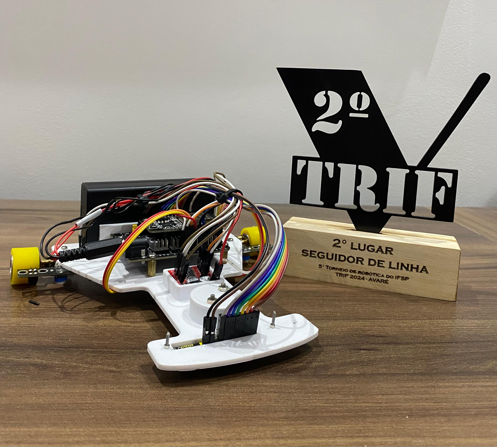

# Seguidor de Linha com Controle PID.

O projeto foi realizado pelo grupo de robótica "Cubatrix" durante o 4° Semestre de Engenharia de Controle e Automação. Conquistamos 2° lugar na modalidade de seguidores de linha
no TRIF de 2024.

Participantes do projeto:

* Arthur Hirury Hwang Bo; 
* Gabriel Henrique Castilho; 
* Matheus Cardoso Medeiros. 

## Lista de componentes utilizados:

* 1x ESP32
* 1x Shield para ESP32
* 1x Array de 8 sensores IR QRE-8D
* 2x Sensores IR KY-033
* 1x Driver L298N Mini
* 2x Micro Motor DC 1000 RPM 6V
* 2x Rodas StickyMAX 22mm
* 1x Suporte para baterias de íon-lítio 18650
* 2x Baterias íon-lítio 3.7V

## Funcionamento e Projeto:

